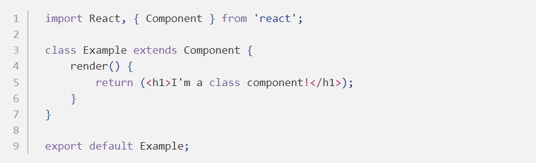
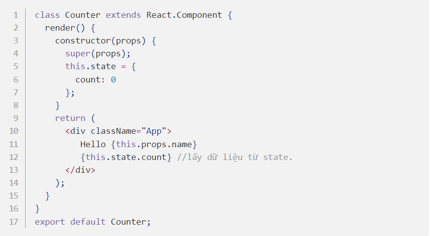

## Class (Stateful) Components

Class components là những class ES6. Chúng phức tạp hơn functional components ở chỗ nó còn có: phương thức khởi tạo, life-cycle, hàm render() và quản lý state (data). Ví dụ dưới đây là class component:

Bạn có thể thấy, class Example kế thừa Component, vì vậy React hiểu class này là một component, và nó renders (returns) 1 React Element.

Vì vậy, một React class component là:

- Là một class ES6, nó sẽ là một component khi nó "kế thừa" React component.
- Có thể nhận props (trong hàm khởi tạo) nếu cần.
- Được khởi tạo với 1 vòng lifecycle hoàn chỉnh
- Phải có 1 method render() trả về 1 React element (JSX), or null

## Vậy sự khác nhau giữa Class Component và Functional Component là ?

Class Component - Stateful Components: Với Class Component chúng ta có thể sử dụng được state một cách dễ dàng khi khởi tạo (init) state ngay trong phương thức constructor của Class Component bằng this.state:

Để thay đối state chúng ta có cách duy nhất chính là thông qua sử dụng phương thức setState().

Functional Component - Stateless Components: Trái ngược với Class Component, Functional Component trước đây vốn không thể làm những thứ phức tạp như làm việc quản lí với state. Nhưng với những bản mới nhất của React đã cập nhật thêm React Hooks để cho phép chúng ta làm việc đó thông qua những function như useState() . Các ban có thể vào trang chủ của React để đọc chi tiết về chúng. Những bài viết sau trong series này mình sẽ đề cập về hooks hay lifecycles của Component.

Tóm lại tùy vào nhu cầu sử dụng mà chúng ta có thể linh hoạt lựa chọn sử dụng Class Components hay Functional Components. Theo xu hướng hiện tại trên cá nhân tôi thấy việc sử dụng Functional Components rất tiện lợi cho việc bảo trì (maintain) sau này cũng như nhiều developer đang sử dụng Functional Components thay cho Class Components. Một phần nữa theo cá nhân tôi thấy việc sử dụng Functional Components cũng dễ đọc hiểu hơn cho những người phát triển dự án sau này. Mọi người có thể tự sử dụng cả 2 cách để đánh giá xem cách nào tối ưu hơn nhé !
